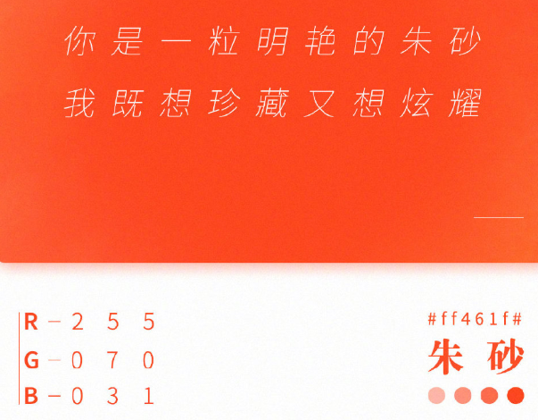
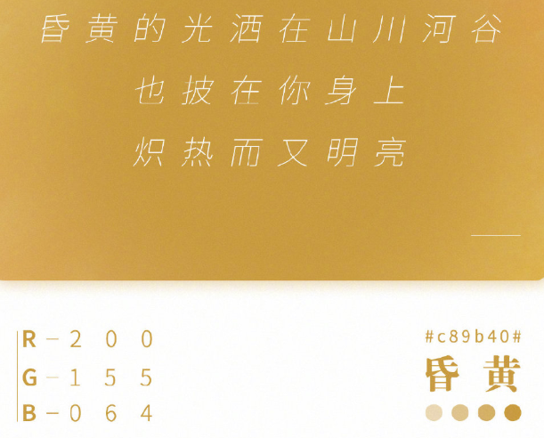
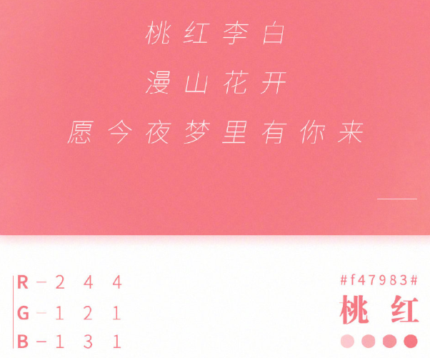
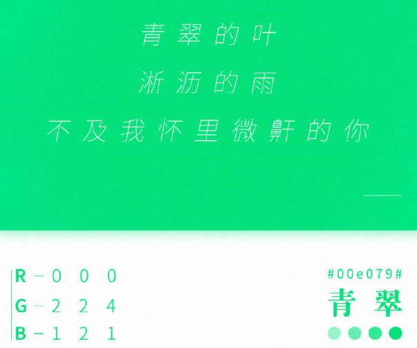
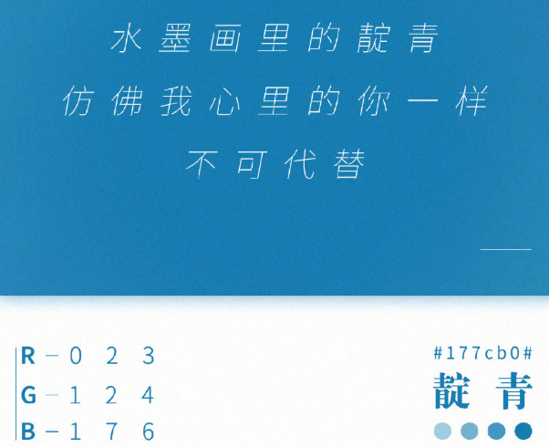
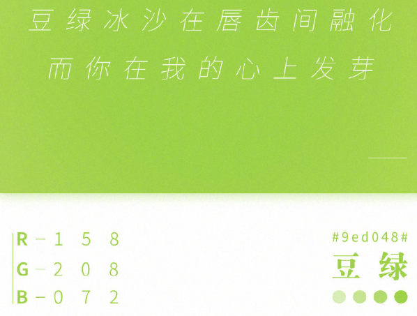

<script type="text/x-mathjax-config">
MathJax.Hub.Config({
  tex2jax: {inlineMath: [['$','$'], ['\\(','\\)']]}
});
</script>
<script type="text/javascript" async src="https://cdnjs.cloudflare.com/ajax/libs/mathjax/2.7.5/MathJax.js?config=TeX-MML-AM_CHTML"></script>
# ***<u>在Markdown中使用Mathjax</u>***

* 添加：

  ```html
  <script type="text/x-mathjax-config">
MathJax.Hub.Config({
  tex2jax: {inlineMath: [['$','$'], ['\\(','\\)']]}
});
</script>
  <script type="text/javascript" async src="https://cdnjs.cloudflare.com/ajax/libs/mathjax/2.7.1/MathJax.js?config=TeX-AMS-MML_HTMLorMML"> </script>
  ```

  ​		<font color="crimson" size="10px">mathjax的cdn取消服务了，要换成cloudflare的</font>

formula1: $$n==x$$

formula2: $n!=x$

formula3: (m==y)

formula4: [m!=y]

formula5: \(k==z\)

formula6: \[k!=z\]

This is a test:$$\sum_{i=1}^n a_i=0$$

下面是配色:  

