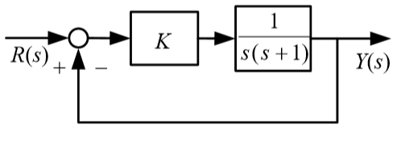

# 根轨迹分析法

1. 系统闭环特征方程的根的位置决定闭环系统的稳定性和动态特性.
2. 分析闭环控制系统的稳态性能与动态性能需要求闭环特征方程的根(闭环极点).
3. 计算量很大.
4. 不能直观了解参数变化对于系统性能的影响趋势.

# 根轨迹法-几何求解特征根

1. 根轨迹-系统中某一参数在全部范围内变化时,系统闭环特征根随之变化的轨迹.
2. 在已知开环零点的条件下,绘制出闭环特征根在$s$平面上随系统参数变化的的运动轨迹.
3. 根轨迹可以直观反映出闭环系统特征根在$s$平面上的位置及变化情况.
4. 可以得到闭环系统时间相应的全部信息,分析系统参数与闭环特征根之间的关系.
5. 研究闭环特征根的分布与闭环系统的动态特性之间的定性和定量关系.
6. 根据控制系统动态特性要求决定闭环极点在根平面的位置.

# 根轨迹的概念

二阶系统的方块图如下,绘制它的根轨迹.  

开环传递函数:$G(s)H(s)=\frac{K}{s(s+1)}$  

闭环传递函数:$\frac{G(s)}{1+G(s)H(s)}=\frac{K}{s^2+s+K}$  

* 系统有两个开环极点$p_1=0,p_2=-1,$没有开环零点.
* 闭环特征方程$s^2+s+K=0$  求出两个闭环特征根$s_{1,2}=-0.5$