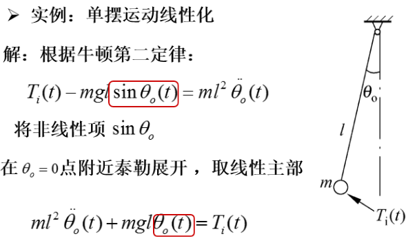

# 数学模型线性化

* ## 线性化问题的提出

  *  非线性现象：

    机械系统中的高速阻尼器,阻尼力与速度的平方有关；具有铁芯的电感，电流与电压的非线性关系；晶体管等电子器件的非线性。

  * 线性化：在一定条件下作某种近似或缩小系统工作范围，将非线性微分方程近似为线性微分方程处理。

* ## 非线性系统数学模型的线性化

  * 泰勒级数展开法

    函数$y=f(x)$在平衡点$(a,f(a))$附近的泰勒级数展开式为：
    $$f(x)=\frac{f(a)}{0!}+\frac{f^{'}(a)}{1!}(x-a)+\frac{f^{''}(a)}{2!}(x-a)^2+\frac{f^{(n)}(a)}{n!}(x-a)^n+\cdots+R_n(x)$$    
    略去含有高于一次的增量:$\Delta x=x-a$则：
    $$y-y_0=\Delta y=K\Delta x$$
    上式为非线性系统的线性化模型，是增量方程是系统的静态方程。	
    反馈系统就是在一个值附近波动，这种方法具有实际意义。  
    增量方程的数学含义就是将参考坐标的原点移到系统或元件的平衡点上，对于实际系统就是以正常工作状态为研究系统运动的起始点，系统所有的初始条件    为零。
* ## 系统线性化微分方程的建立
	1. 确定系统各组成元件在平衡态的工作点
	2. 列出各组成元件在工作点附近的增量方程
	3. 消除中间变量，得到以增量表示的线性化微分方程
	
	* 线性化处理的注意事项
		* 线性化方程的系数与平衡工作点的选择有关
		* 线性化是有条件的，必须注意线性化方程的适用工作范围
		* 某些典型的本质非线性，如继电器特性、间隙、死区，由于存在不连续点，不能通过泰勒展开进行线性化，只有影响很小时可以忽略，否则只能作为非线性问题处理。

[返回自动控制原理目录](./pac.md)
    
    	