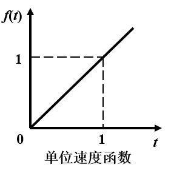

# 拉氏变换和拉氏反变换
* ## 拉氏变换
	设函数$$f(t)(t \ge 0)$$在任意区间上分段连续，且存在一正实数$$\sigma$$,使得：
	$$\lim_{t \to \infty}e^{-\sigma t}|f(t)| \to 0$$
	$$f(t)$$的增长不能超过负指数对他的衰减。
	则函数$$f(t)$$的拉氏变换存在，并定义为：
	$$F(s)=L[f(t)]\equiv \int_{0}^{\infty}f(t)e^{-st}dt$$
	式中：$$s=\sigma +j\omega(\sigma ,\omega $$均为实数）为复变函数；  
	$$\int_{0}^{\infty}e^{-st}dt$$称为拉普拉斯积分  
	$$F(s)$$称为函数$$f(t)$$的拉普拉斯变换或象函数，
	它是一个复变函数，$$f(t)$$称为$$F(s)$$的原函数
* ## 拉氏反变换
	$$f(t)=L^{-1}[F(s)]$$
	$$L^{-1}$$为拉氏反变换的符号。  
	Laplace变换是描述分析连续、时不变、线性系统的重要工具
	Laplace变换可以理解为广义单边傅里叶变换。傅里叶变换建立了时域和频域的关系，
	Laplace变换建立了时域和负频域的关系。
* ## 简单函数的拉氏变换
	* ### 单位阶跃函数$$1(t)$$

		$$1(t) = 
		\begin{cases}
		 0 & t<0 \\ 
		 1 & t \geq 0  
		 \end{cases} $$
		$$L[1(t)]=\int_{0}^{\infty}1(t)e^{-st}dt=-\frac{1}{s}e^{-st}\big|_{0}^{\infty}=\frac{1}{s}$$
		  
	* ### 指数函数
		$$f(t)=e^{-at}$$($$a$$为常数)
		$$L[e^{-at}]=\int_{0}^{\infty}e^{-at}\cdot e^{-st}dt=\int_{0}^{\infty}e^{-(s+a)t}dt=\frac{1}{s+a},(Re(s+a)>0)$$
		
	* ### 正弦及余弦函数
		$$L[sin\omega t]=\int_{0}^{\infty}sin\omega t\cdot e^{-st}dt$$
		$$L[cos\omega t]=\int_{0}^{\infty}cos\omega t\cdot e^{-st}dt$$  
		由欧拉公式
		$$e^{j\theta}=cos\theta + j sin\theta$$
		$$e^{-j\theta}=cos\theta - j sin\theta$$
		有：$$sin\omega t =\frac{1}{2j}(e^{j\omega t}-e^{-j\omega t})$$
		$$cos\omega t=\frac{1}{2} (e^{j\omega t}+ e^{-j\omega t})$$
		从而
		$$L[sin \omega t] = \frac{1}{2j}(\int_{0}^{\infty}e^{j\omega t}e^{-st}dt-\int_{0}^{\infty}e^{-j\omega t}e^{-st})=\frac{1}{2j}(\frac{1}{s-j\omega}-\frac{1}{s+j\omega})=\frac{\omega}{s^2+\omega^2}    (Re(s)>0)$$
		同理$$L[cos\omega t]=\frac{s}{s^2+\omega^2}$$  
		
	* ### 单位脉冲函数$$\delta (t)$$
		$$\delta (t)=\begin{cases} 0 &(t,0且t>\varepsilon) \\ \lim_{\varepsilon \to 0}\frac{1}{\varepsilon} &(0<t<\varepsilon)	\end{cases}$$
		$$L[\delta (t)]=\int_{0}^{\infty}\lim_{\varepsilon \to 0}\frac{1}{\varepsilon}\cdot e^{-st}dt=\lim_{\varepsilon \to 0}\frac{1}{\varepsilon s}(1-e^{-\varepsilon s})$$
		由洛必达法则：$$\lim_{\varepsilon \to 0}\frac{1}{\varepsilon}(1-e^{-\varepsilon s})=\lim_{\varepsilon \to 0}\frac{(1-e^{-\varepsilon s})'}{(\varepsilon s)'}$$
		所以：$$L[\varepsilon (t)]=\lim_{\varepsilon \to 0}\frac{\varepsilon \cdot e^{-\varepsilon s}}{\varepsilon}=1$$  
		
	* ### 单位速度函数
		$$f(t)=\begin{cases}	0 & t<0 \\ t & t \geq 0	\end{cases}$$
		$$[f(t)]  =\int_{0}^{\infty}te^{-st}dt  = t\frac{e^{-st}}{-s}\big|_{0}^{\infty}-\int_{0}^{\infty}\frac{e^{-st}}{-s}dt=\frac{1}{s^2}(Re(s)>0)$$
		
	* ### 单位加速度函数
		$$f(t)=\begin{cases} 0 & t<0 \\ \frac{1}{2}t^2 & t \geq 0	\end{cases}$$
		$$L[f(t)]=\int_{0}^{\infty}\frac{1}{2}t^2e^{-st}dt=\frac{1}{s^3}(Re(s)>0)$$
		
	* ### 幂函数$$t^n\cdot 1(t)$$
		令$$u=st$$  
		则$$t=\frac{u}{s},dt=\frac{1}{s}du$$
		$$L[t^n \cdot 1(t)]=\int_{0}^{\infty}t^ne^{-st}dt=\frac{1}{s^{n+1}}\int_{0}^{\infty}u^ne^{-u}du=\frac{n!}{s^{n+1}}$$  
		函数的拉氏变换及反变换通常可以由拉氏变换表直接或通过一定的转换得到.
* ## 拉氏变换的性质  
	* ### 叠加原理
		* 齐次性：$$L[af(t)]=aL[f(t)]$$,$$a$$为常数；
		* 叠加性：$$L[af_1(t)+bf_2(t)]=aL[f_1(t)]+bL[f_2(t)]$$ $$a,b$$为常数；
	显然拉氏变换为线性变换。
	* ### 微分定理
		$$L[\frac{df(t)}{dt}]=sF(s)-f(0),f(0)=f(t)\big|_{t=0}$$
		在初始条件为0的情况下，  
		推论：  
		$$\begin{cases} 
		L[\frac{df(t)}{dt}]=sF(s)\\ 
		...... \\ 
		L[\frac{d^nf(t)}{dt^n}]=s^nF(s)
		\end{cases}$$
	* ### 复微分定理
		若$$L[f(t)=F(s)]$$，则除了$$F(s)$$的极点之外，有：  
		$$\begin{cases}
		\frac{d}{ds}F(s)=-L[tf(t)] \\
		\frac{d^2}{ds^2}F(s)=L[t^2f(t)] \\
		...... \\
		\frac{d^n}{ds^n}F(s)=(-1)^nL[t^nf(t)]	(n=1,2,3,...)
		\end{cases}$$
		即：
		$$L[tx(t)]=-\frac{dX(s)}{ds},L[t^nx(t)]=(-1)^n\frac{d^nX(s)}{ds^n}$$
	* ### 积分分定理	
		$$L[\int f(t)dt]=\frac{F(s)}{s}$$
		$$L[\underbrace{\int ... \int}_n f(t)dt]=\frac{1}{s^n}F(s)$$
		初始条件为0
	* ### 延时定理	
		$$L[x(t-a)\cdot 1(t-a)]=e^{-as}X(s)$$
	* ### 衰减定理	
		$$L[e^{-at}f(t)]=F(s+a)$$
		
	* ### 初值定理
		$$\lim_{t \to 0^+}f(t)=\lim_{s \to \infty}sF(s)$$
	* ### 终值定理
		$$\lim_{t \to \infty}f(t)=f(\infty)=\lim_{s \to 0}sF(s)$$
	* ### 卷积定理	
		$$L[f(t)*g(t)]=F(s)g(s)$$
		其中，$$f(t)*g(t)$$表示函数$$f(t)$$和$$g(t)$$的卷积。
		若$$t<0$$时，$$f(t)=g(t)=0$$则$$f(t)$$和$$g(t)$$的卷积可表示为：
		$$f(t)*g(t)=\int_{0}^tf(t-\tau)g(\tau)d\tau =\int_{0}^tf(\tau)g(1- \tau)d\tau$$
	* ### $$f(\frac{t}{a})$$的象函数	
		$$L[f(\frac{t}{a})]=aF(s)$$  
		
* ## 拉氏反变换 		
	* ### 部分分式法
		$$
			L^{-1}[F(s)]=L^{-1}[F_1(s)]+L^{-1}[F_2(s)]+...+L^{-1}[F_n(s)] 
			=f_1(t)+f_2(t)+...+f_n(t)
		$$
		在控制理论中，通常
		$$F(s)=\frac{B(s)}{A(s)}=\frac{b_xs^m+b_1s^{m-1}+...+b_{m-1}s+b_m}{a_0s^n+a_1s^{n-1}+...+a_{n-1}s+a_n}$$
		为了应用上述方法，将$$F(s)$$写成下面的形式：
		$$F(s)=\frac{B(s)}{A(s)}=\frac{c_0s^m+c_1s^{m-1}+...+c_{m-1}s+b_m}{(s+p_1)(s+p_2)...(s+p_n)}$$
		式中，$$p_1,p_2,...,p_n)$$是$$F(s)$$的极点；此时可将$$F(s)$$展开成部分分式。
	* ### 只含不同单极点的情况	
		$$F(s)=\frac{B(s)}{A(s)}=\frac{A_1}{s+P_1}+\frac{A_2}{s+P_2}+...+\frac{A_n}{s+P_n}=\sum_{i=1}^{n}\frac{A_i}{s+P_i}$$
		式中，$$A_i$$为常数，称为$$s=-P_i$$极点处的留数。
		$$A_i=[F(s)\cdot (s+P_i)]_{s=-P_i}$$
		于是$$L^{-1}[F(s)]=L^{-1}[\sum_{i=1}^n\frac{A_i}{s+P_i}]=\sum_{i=1}^nA_ie^{P_it}$$
		
		
	* ### 含共轭复数极点情况
		* #### 方法一
			假设$$F(s)$$含有一对共轭复数极点$$p_1,p_2$$，其余极点均为各不同的实数极点，则：
			$$F(s)=\frac{B(s)}{A(s)}=\frac{A_1s+A_2}{(s+p_1)(s+p_2)}+\frac{A_3}{s+p_3}+...+\frac{A_n}{s+p_n}$$
			式中$$A_1$$和$$A_2$$的值由下式求解：
			$$[F(s)(s+p_1)(s+p_2)]_{s=-p_1或 s=-p_2}=[A_1s+A_2]_{s=-p_1或 s=-p_2}$$
			上式为复数方程，令方程两端实部、虚部分别相等即可确定$$A_1$$和$$A_2$$的值。
		* #### 方法二
			此时$$F(s)$$仍可分解成下列形式：
			$$F(s)=\frac{B(s)}{A(s)}=\frac{A_1}{s+p_1}+\frac{A_2}{s+p_2}+...+\frac{A_n}{s+p_n}=\sum_{i=1}^n\frac{A_i}{s+p_i}$$	
			由于$$p_1,p_2$$为共轭复数，因此$$A_1,A_2$$也是共轭复数$$A_i=[F(s)\cdot (s+p_i)]_{s=-p_i}$$
		* #### 方法一例：
			求$$F(s)=\frac{s+}{s(s^2+s+1)}$$的原函数。
			解：$$F(s)=\frac{s+1}{s(s+\frac{1}{2}+j\frac{\sqrt{3}}{2})(s+\frac{1}{2}-j\frac{\sqrt{3}}{2})}$$	
			$$A_0=sF(s)\big|_{s=0}=1$$
			$$(s^2+s+1)F(s)\big|_{s=-\frac{1}{2}-j\frac{\sqrt{3}}{2}}=(A_1s+A_2)\big|_{s=-\frac{1}{2}-j\frac{\sqrt{3}}{2}}$$
			实部和实部相等，虚部和虚部相等。
			即：$$\begin{cases}		
			-\frac{1}{2}(A_1+A_2)=\frac{1}{2}  \\
			\frac{\sqrt{3}}{2}(A_1-A_2)=-\frac{\sqrt{3}}{2}
			\end{cases}$$
			所以
			$$\begin{aligned}
			F(s)&=\frac{1}{s}-\frac{s}{s^2+s+1} \\
			&=\frac{1}{s}-\frac{s}{(s+\frac{1}{2})^2+(\frac{\sqrt{3}}{2})^2}  \\
			&=\frac{1}{s}-\frac{s+\frac{1}{2}}{(s+\frac{1}{2})^2+(\frac{\sqrt{3}}{2})^2}+\frac{\frac{1}{2}}{(s+\frac{1}{2})^2+(\frac{\sqrt{3}}{2})^2}  \\
			&=\frac{1}{s}-\frac{s+\frac{1}{2}}{(s+\frac{1}{2})^2+(\frac{\sqrt{3}}{2})^2}+\frac{1}{\sqrt{3}}\frac{\frac{\sqrt{3}}{2}}{(s+\frac{1}{2})^2+(\frac{\sqrt{3}}{2})^2}  \\
			\end{aligned}$$
			$$f(t)=1-e^{-\frac{t}{2}}cos\frac{\sqrt{3}}{2}t+\frac{1}{\sqrt{3}}e^{-\frac{t}{2}}sin\frac{\sqrt{3}}{2}t$$
		* #### 方法二例：	
			
			
	* ### 含多重极点情况
		略。。。

[返回自动控制原理目录](./pac.md)