

# 传递函数
  * ## 传递函数的意义
    传递函数$G(s)=\frac{X_0(s)}{X_i(s)}$    
    在零初始条件下，线性定常系统输出量的拉氏变换与引起该输出量的拉氏变换之比。  
    零初始条件：
    * $t<0$时，输入量及其各阶导数均为0；
    * 输入量施加于系统之前，系统处于稳定的工作状态，即$t<0$时，输入量及其各阶导数也为0；  
    设线性定常系统的微分方程为：  
    $$a_0x_0^n(t)+a_1x_0^{n-1}(t)+...+a_{n-1}x_0^{'}+a_nx_0(t)$$  
    $$=b_0x_i^m(t)+b_1x_i^{m-1}(t)+...+b_{m-1}x_i^{'}(t)+b_mx_i(t)$$
    零初始条件下拉氏变换，得  
    $$(a_0s^n+a_1s^{n-1}+...+a_{n-1}s+a_n)X_0(s)$$  
    $$(b_0s^m+b_1s^{m-1}+...+b_{m-1}s+b_m)X_i(s)$$  
    则系统传递函数为：  
    $$G(s)=\frac{X_0(s)}{X_i(s)}=\frac{b_0s^m+b_1s^{m-1}+...+b_{m-1}s+b_m}{a_0s^n+a_1s^{n-1}+...+a_{n-1}s+a_n}$$  
    特点：
    * 比微分方程简单，通过拉氏变换，实数域复杂的微分运算已经转化为简单的代数运算；
    * 输入典型型号时，其输出与传递函数有一定对应关系，当输入是单位脉冲函数时，输入的象函数为1，其输出象函数与传递函数相同
    * 令传递函数中的$s=j\omega$,则系统可在频率域内分析
    * $G(s)$的零极点分布决定系统动态特性
    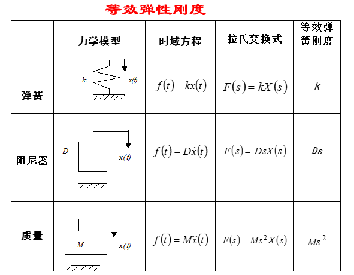
    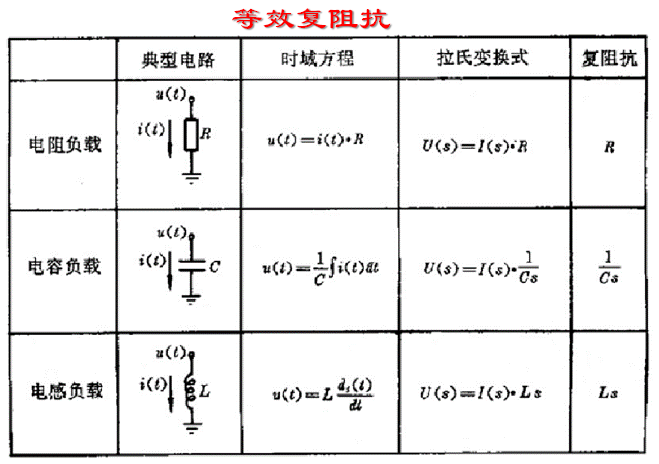
  * ## 传递函数求解示例
    * 质量-弹簧-阻尼系统的传递函数
        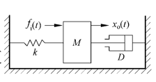
        $$m\frac{d^2}{dt^2}x_o(t)+D\frac{d}{dt}x_o(t)+kx_o(t)=f_i(t)$$  
        所有初始条件均为零时,其拉氏变换为:
        $$ms^2X_o(s)+DsX_o(s)+kX_o(s)=F_i(s)$$  
        按照定义,系统的传递函数为:
        $$G(s)=\frac{X_0(s)}{F_i(s)}=\frac{1}{ms^2+Ds+k}$$
    * R-C-L无源电路网络的传递函数
        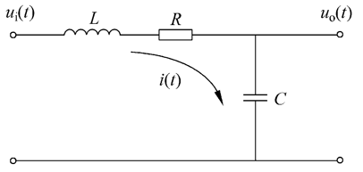
        $$G(s)=\frac{U_o(s)}{U_i(s)}=\frac{\frac{1}{Cs}}{Ls+R+\frac{1}{Cs}}=\frac{1}{LCs^2+RCs+1}$$
  * ## 几点结论
    * 传递函数是复数$s$域中的系统数学模型,其参数仅取决于系统本身的结构及参数,与系统的输入形式无关.
    * 若输入给定,则系统输出特性完全由传递函数$G(s)$决定,即传递函数表征了系统内在的固有动态特性.
    * 传递函数通过系统输入量与输出量之间的关系来描述系统的固有特性.即以系统外部的输入输出特性来描述系统的内部特性.
  * ## 传递函数的一般形式
    考虑线性定常系统
    $$a_0x_0^n(t)+a_1x_0^{n-1}(t)+...+a_{n-1}x_0^{'}+a_nx_0(t)$$  
    $$=b_0x_i^m(t)+b_1x_i^{m-1}(t)+...+b_{m-1}x_i^{'}(t)+b_mx_i(t)$$
    当初始条件全为零时,对上式进行拉氏变换可得系统传递函数的一般形式:
    $$G(s)=\frac{X_0(s)}{X_i(s)}=\frac{b_0s^m+b_1s^{m-1}+...+b_{m-1}s+b_m}{a_0s^n+a_1s^{n-1}+...+a_{n-1}s+a_n}$$
* ## 特征方程,零点和极点
    * 特征方程
        令:$$N(s)=b_0s^m+b_1s^{m-1}+...+b_{m-1}s+b_m$$
        $$D(s)=a_0s^{n}+a_1s^{n-1}+...+a_{n-1}s+a_n$$
        则:$$G(s)=\frac{X_o(s)}{X_i(s)}=\frac{N(s)}{D(s)}$$
        $D(s)=0$称为系统的特征方程.特征方程决定着系统的动态特性.$D(s)$中$s$的最高阶次等于系统的阶次.  
        当$s=0$时:$$G(0)=\frac{b_m}{a_n}=K$$
        式中,$K$称为系统的静态放大系数或静态增益.从微分方程的角度来看,此时相当于所有的导数项都为零,输入与输出的比值.
    * 零点和极点
        将$G(s)$写成下面形式
        $$G(s)=\frac{X_o(s)}{X_i(s)}=\frac{b_0(s-z_1)(s-z_2)...(s-z_m)}{a_0(s-p_1)(s-p_2)...(s-p_n)}$$
        式中,$N(s)=b_0(s-z_1)(s-z_2)...(s-z_m)=0$的根$s=z_i(i=1,2,...,m)$,称为传递函数的零点;$D(s)=a_0(s-p_1)(s-p_2)...(s-p_n)=0$的根$s=p_i(i=1,2,...,m)$,称为传递函数的极点;  
        系统传递函数的极点就是系统的特征根.零点和极点的数值完全取决于系统的结构参数.
    * 零,极点分布图
        将传递函数的零极点表示在复平面上的图形称为传递函数的零极点分布图.图中,零点用"O"表示,极点用"X"表示.
        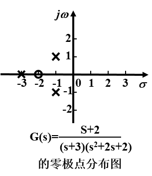
* ## 传递函数的几点说明 
    * 传递函数是一种以系统参数表示的线性定常系统输入量和输出量之间的关系式;传递函数的概念通常只适用于线性定常系统.
    * 传递函数是$s$的复变函数.传递函数中的各项系数和相应微分方程中的各项系数对应相等,完全取决于系统结构参数.
    * 传递函数是在零初始条件下定义的,即在零时刻之前,系统对所给定的平衡工作点处于相对静止状态.因此,传递函数不反应系统在非零初始条件下的全部运动规律.
    * 传递函数只能表示系统输入与输出的关系,无法描述系统内部中间变量的变化情况.
    * 一个传递函数只能表示一个输入对一个输出的关系,适合于单输入单输出系统的描述,对于多输入多输出系统将采用传递函数阵.
* ## 脉冲响应函数         
    初始条件为零时,系统在单位脉冲输入作用下的输出响应的拉氏变换为
    $$Y(s)=G(s)X(s)=G(s)$$
    拉氏反变换
    $$y(t)=L^{-1}[Y(s)]=L^{-1}[G(s)]=g(t)$$
    $g(t)$称为系统的脉冲响应函数.系统的脉冲响应函数与传递函数包含于系统动态特性的相同信息.
* ## 典型环节及其传递函数 
    * 环节
        具有某种确定信息传递关系的元件,元件组或元件的一部分称为一个环节.经常遇到的环节称为典型环节  
        任何复杂的系统总可归结为由一些典型环节所组成.
    * 环节的分类
        假设系统有$b$个实零点,$c$个复零点,$d$个非零实极点,$e$对复极点和$v$个等于零的极点,线性系统传递函数的零,极点表达式为
        $$G(s)=\frac{X_o(s)}{X_i(s)}=\frac{b_0(s-z_1)(s-z_2)...(s-z_m)}{a_0(s-p_1)(s-p_2)...(s-p_n)}$$
        式中,$b+2c=m$,$v+d+2e=n$  
        对于实零点$z_i=-\alpha_i$和实极点$p_j=-\beta_j$,其因式可以变换成如下形式:
        $$s-z_i=s+\alpha_i=\frac{1}{\tau_i}(\tau_is+1),\tau_i=\frac{1}{\alpha_i}$$
        $$s-p_j=s+\beta_j=\frac{1}{T_j}(T_js+1),T_j=\frac{1}{\beta_j}$$
        对于复零点对$z_e=-\alpha_e+j\omega_e$和$z_{e+1}=-\alpha_e-j\omega_e$,其因式可以变换成如下形式:
        $$\begin{aligned}
        (s-z_e)(s-z_{e+1})&=(s+\alpha_e-j\omega_e)(s+\alpha_e+j\omega_e)\\
        &=s^2+2\alpha_es+\alpha_e^2+\omega_e^2\\
        &=\frac{1}{\tau_e^2}(\tau_e^2+2\zeta_e\tau_es+1)\\
        \end{aligned}$$
        式中,$\tau_e=\frac{1}{\sqrt{\alpha_e^2+\omega_e^2}},\zeta_e=\frac{\alpha_e}{\sqrt{\alpha_e^2+\omega_e^2}}$  
        对于复极点对$p_k=-\alpha_k+j\omega_k$和$p_{k+1}=-\alpha_k-j\omega_k$,其因式可以变换成如下形式:
        $$\begin{aligned}
        (s-p_k)(s-p_{k+1})&=(s+\beta_k-j\omega_k)(s+\beta_k+j\omega_k)\\
        &=s^2+2\beta_ks+\beta_k^2+\omega_k^2\\
        &=\frac{1}{T_k^2}(T_k^2+2\varsigma_kT_ks+1)\\
        \end{aligned}$$
        式中,$T_k=\frac{1}{\sqrt{\beta_k^2+\omega_k^2}},\varsigma_k=\frac{\beta_k}{\sqrt{\beta_k^2+\omega_k^2}}$  
        于是,系统的传递函数可以写成:
        $$G(s)=\frac{K\prod_{i=1}^b(\tau_is+1)\prod_{e=1}^c(\tau_e^2s^2+2\zeta_e\tau_es+1)}{s^v\prod_{j=1}^d(T_js+1)\prod_{k=1}^e(T_k^2s^2+2\zeta_kT_ks+1)}$$
        式中,$K=\frac{b_0}{a_0}\cdot \prod_{i=1}^b\frac{1}{\tau_i}\cdot \prod_{e=1}^c\frac{1}{\tau_i^2}\cdot \prod_{j=1}^dT_j\cdot \prod_{k=1}^eT_k^2$为系统静态放大倍数.
        由上式可见,传递函数表达式包含六种不同的因子,即:
        $$K,\tau s+1,\tau^2s^2+2\zeta \tau s+1,\frac{1}{s},\frac{1}{Ts+1},\frac{1}{T^2s^2+2\zeta Ts+1}$$
        一般,任何线性系统都可以看做是由上述六种因子表示的典型环节的串联组合.上述六种典型环节分别称为:  
        * 比例环节:$K$  
            输出量不失真,无惯性的跟随输入量,两者成比例关系.  
            其运动方程为:$x_o(t)=Kx_i(t)$  
            $x_o(t),x_i(t)$分别为环节的输入和输出量;  
            $K$比例系数,等于输出量与输入量之比
            比例环节的传递函数为:
            $$G(s)=\frac{X_o(s)}{X_i(s)}=K$$
            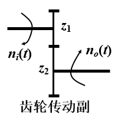
            $$G(s)=\frac{N_o(s)}{N_i(s)}=\frac{z_1}{z_2}=K$$
            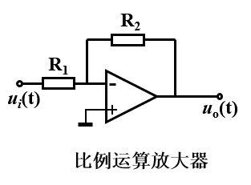
            $$G(s)=\frac{U_o(s)}{U_i(s)}=-\frac{R_2}{R_1}=K$$
        * 一阶微分环节:$\tau s+1$  
            输出量正比于输入量的微分.
            运动方程为:$x_o(t)=\tau \frac{dx_i(t)}{dt}$  
            传递函数为:$G(s)=\frac{X_o(s)}{X_i(s)}=\tau s$  
            式中,$\tau$为微分环节的时间常数  
            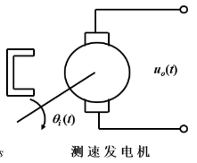  
            无负载时$u_o(t)=K_t\frac{d\theta_i(t)}{dt}$式中$K_t$为电机常数.  
            $$G(s)=\frac{U_o(s)}{\Theta_i(s)}=K_ts$$
            无源微分网络:  
            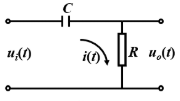  
            $$u_i(t)=\frac{1}{C}\int i(t)dt+i(t)R$$
            $$u_o(t)=i(t)R$$
            $$G(s)=\frac{RCs}{RCs+1}=\frac{Ts}{Ts+1},T=RC$$
            显然,无源微分网络包括有惯性环节和微分环节,称之为惯性微分环节,只有当$|Ts|\ll 1$时,才近似为微分环节.  
            在物理系统中输入输出同量纲的微分环节很难独立存在,经常和其他环节一起出现.  
            还有一类,其传递函数为:
            $$G(s)=\frac{X_o(s)}{X_i(s)}=K(\tau s+1)$$
            微分环节的输出是输入的导数,输出反应了输入信号的变化趋势,从而给系统以有关输入变化趋势的预告.因此,微分环节常用来改善系统的动态性能.
        * 二阶微分环节:$\tau^2s^2+2\zeta \tau s+1$
        * 积分环节:$\frac{1}{s}$
            输出量正比于输入量对时间的积分.
            运动方程为:$x_o(t)=\frac{1}{T}\int_0^tx_i(t)dt$
            传递函数为:$G(s)=\frac{X_o(s)}{X_i(s)}=\frac{1}{Ts}$  
            积分环节特点:  
            * 输出量取决于输入量对时间的积累过程.
            * 具有明显滞后作用.
            积分环节常用来改善系统的稳态精度.  
            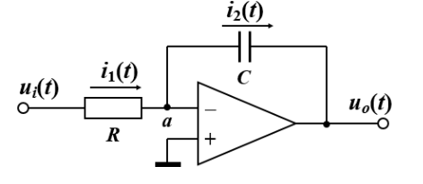  
            $$RC\frac{du_o(t)}{dt}=-u_i(t)$$
            $$G(s)=-\frac{1}{RCs}=-\frac{1}{Ts},T=RC$$
        * 惯性环节:$\frac{1}{Ts+1}$ 
            凡运动方程为下面一阶微分方程
            $$T\frac{d}{dt}x_o(t)+x_o(t)=Kx_i(t)$$
            形式的环节称为一阶惯性环节.其传递函数为:
            $$G(s)=\frac{X_o(s)}{X-i(s)}=\frac{K}{Ts+1}$$
            式中K为环节增益,T为时间常数,表征环节的惯性,和环节结构参数有关.  
            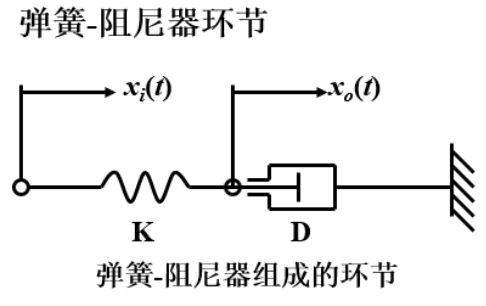  
            $$D\frac{dx_o(t)}{dt}+Kx_o(t)=Kx_i(t)$$
            $$G(s)=\frac{K}{Ds+k}=\frac{1}{Ts+1},T=\frac{D}{K}$$
        * 震荡环节:$\frac{1}{T^2s^2+2\zeta Ts+1}$
        含有两个独立的储能元件,且所储存的能量能够相互转换,从而导致输出带有振荡的性质,运动方程为:
        $$T^2\frac{d^2x_o(t)}{dt^2}+2\zeta T\frac{dx_o(t)}{dt}+x_o(t)=Kx_i(t),0<\zeta<1$$
        传递函数:$G(s)=\frac{X_O(s)}{X_i(s)}=\frac{K}{T^2s^2+2\zeta Ts+1}$式中,$T$为振荡环节的时间常数  
        $\zeta$为阻尼比,对于衰减振荡环节,$0<\zeta<1$  
        $K$比例系数  
        二阶振荡环节传递函数的另一常用标准形式为$(K=1)$:  
        $$G(s)=\frac{\omega_n^2}{s^2+2\zeta\omega_ns+\omega_n^2},\omega_n=\frac{1}{T}$$
        $\omega_n$称为无阻尼固有角频率
        * 延迟环节:$e^{-\tau s}$  
            运动方程:$x_o(t)=x_i(t-\tau)\cdot 1(t-\tau)$  
            传递函数:$G(s)=e^{-\tau s}$  
            式中,$\tau$为纯延迟时间.  
            延迟环节与惯性环节的区别
            * 惯性环节从输入开始时刻起就已有输出,仅由于惯性,输出要滞后一段时间才接近所要求的输出值;
            * 延迟环节从输入开始,在0~$\tau$时间内,没有输出,但$t=\tau$之后,输出等于$\tau$之前时刻的输入.
* ## 小结             
    * 构造数学模型时,环节是根据微分方程划分,往往不是具体的物理装置或元件;
    * 一个环节往往由几个元件之间的运动特性共同组成;
    * 同一元件在不同系统中作用不同,输入输出的物理量不同,可起到不同环节的作用.

[返回自动控制原理目录](./pac.md)