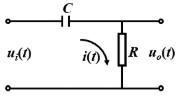

# 系统方框图及其简化

* ## 方块图

  系统方框图是系统控制系统的动态数学模型的图解形式.可以形象直观地描述系统中各环节间的相互关系及其功能以及信号在系统中的传递,变换过程.

  注意:即使描述系统的数学关系式相同,其方框图表达也可有不同形式.

* ## 方框图的结构要素

  * ### 信号线

    带有箭头的直线,箭头表示信号的传递方向,直线旁标记变量,即信号的时间函数或象函数.

      

  * ### 信号线引出点

    表示信号引出或测量位置和传递方向.
    
    同一信号线上引出的信号,其性质,大小完全一样.
    
    
    
  * ### 函数方块
  
    传递函数的图解表示:
  
    
  
    函数方块具有运算功能,即:
    $$
    X_2(s)=G(s)X_1(s)
    $$
  
  * ### 求和点
  
    信号之间代数加减运算的图解.用符号"$\otimes$"及相应的信号箭头表示,每个箭头前方的"$+$"或"$-$"表示加上此信号或减去此信号.
  
    
  
    相邻求和点可以互换,合并,分解,即满足代数运算的交换律,结合律和分配率.
  
    
  
    求和点可以有多个输入,但输出是唯一的.
  
    ​		任何系统都可以由信号线,函数方块,信号引出点及求和点组成的方框图来表示.
  
* ## 系统方框图的建立

  * ### 步骤

    1. 建立系统各环节的微分方程,明确信号的因果关系
    2. 对上述微分方程进行拉氏变换,绘制各环节的方框图.
    3. 按照信号在系统中的传递,变换过程,依次将各环节的方框图链接起来,得到系统的方框图.

  * ### 示例

    * 无源RC网络

      
      $$
      \begin{aligned}
      Ri(t)&=u_i(t)-u_o(t)\\
      u_o(t)&=\frac{1}{C}\int i(t)dt
      \end{aligned}
      $$
      拉氏变换得:
      $$
      \begin{aligned}
      RI(s)&=U_i(s)-U_o(s)\Longrightarrow I(s)=\frac{1}{R}[U_i(s)-U_o(s)]\\
      U_o(s)&=\frac{1}{Cs}I(s)
      \end{aligned}
      $$
      从而可得系统各方框单元及其方框图.

      

      

    * 机械系统

      
      $$
      \begin{cases}
      m_1x^{"}(t)&=f_t-f_D(t)-f_{K_1}(t)\\
      f_{K_1}(t)&=K_1[x(t)-x_o(t)]\\
      f_D(t)&=D(\frac{dx(t)}{dt}-\frac{dx_o(t))}{dt})\\
      m_2x_o^{"}(t)&=f_{K_1}(t)+f_D(t)-f_{K_2}(t)\\
      f_{K_2}(t)&=K_2x_o(t)
      \end{cases}
      \Longrightarrow
      \begin{cases}
      X(s)&=\frac{1}{m_1s^2}[F_i(s)-F_D(s)-F_{K_1}(s)]\\
      F_{K_1}(s)&=K_1[X(s)-X_o(s)]\\
      F_D(s)&=Ds[X(s)-X_o(s)]\\
      X_o(s)&=\frac{1}{m_1s^2}[F_{K_1}(s)+F_D(s)-F_{K_2}(s)]\\
      F_{K_2}(s)&=K_2X_o(s)
      \end{cases}
      $$
      

      

* ## 方框图简化

  * ### 方框图的运算法则

    * 串联

      

    * 并联

      

    * 反馈

      

  * ### 方块图变换法则

    * 求和点的移动

      

    * 引出点的移动

      

* ## 由方框图求传递函数

  基本思路:利用等效变换法则,移动求和点和引出点,消去交叉回路,变换成可以运算的简单回路.

  

[返回自动控制原理目录](./pac.md)