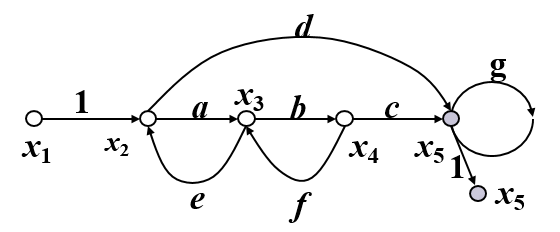
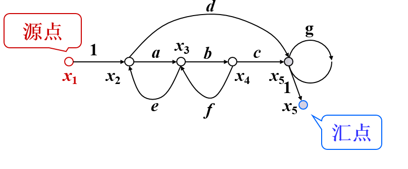
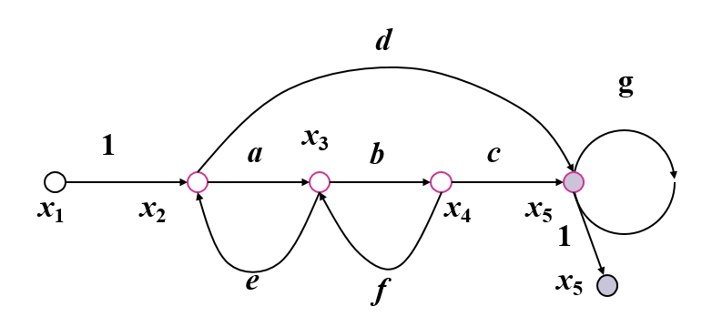
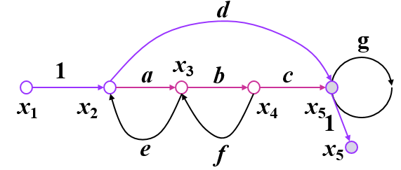
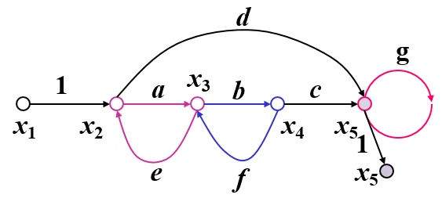
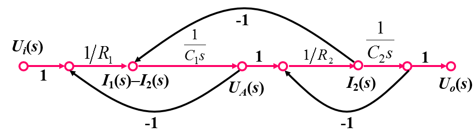
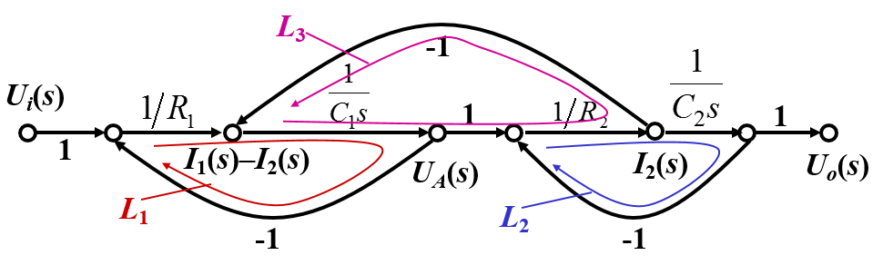

# 信号流图及梅逊公式

* ## 信号流图及其术语

  ​	信号流图起源于梅逊(S.J.MASON)利用图示法来描述一个和一组线性代数方程,是由节点和支路组成的一种信号传递网络.

  例:
  $$
  \begin{aligned}
  x_2&=x_1+ex_3\\
  x_3&=ax_2+fx_4\\
  x_4&=bx_3\\
  x_5&=dx_2+cx_4+gx_5
  \end{aligned}
  $$
  

  * ### 节点

    表示变量或型号,其值等于所有进入该节点的信号之和.节点用"O"表示.

  * ### 支路

    链接两个节点的定向线段,用支路增益(传递函数)表示方程式中两个变量的因果关系.信号在支路上延箭头单项传递.

  * ### 输入节点(源点)

    只有输出的节点,代表系统的输入变量.

    

  * ### 输出节点(阱点,汇点)

    只有输入的节点,代表系统的输出变量.

  * ### 混合节点

    既有输入又有输出的节点.若从混合节点引出一条具有单位增益的支路,可将混合节点变成输出节点.

    

  * ### 通路

    沿支路箭头方向穿过各相连支路的路径.

    

  * ### 前向通路

    从输入节点到输出节点通路上通过任何节点不多于一次的通路.前向通路上各支路增益乘积,称前向通路总增益,一般用$P_k$表示.
    
  * ### 回路
  
    起点与终点重合且通过任何节点不多于一次的闭合通路.回路中所有支路增益乘积称为回路增益,用$L_a$表示.
  
    
    
  * ### 不接触回路
  
    相互间没有任何公共节点的回路.
  
* ## 信号流图的绘制

  两种方法:

  * ### 由系统微分方程绘制信号流图

    根据微分方程绘制信号流图的步骤与绘制方框图的步骤类似.

  * ### 由系统方框图绘制信号流图

* ## 梅逊公式

  $$
  P=\frac{1}{\Delta}\sum_kP_k\Delta_k
  $$

  式中,$P$为系统总传递函数,$P_k为$第$k$条前向通路的传递函数(通路增益),$\Delta$为流图特征式
  $$
  \Delta=1-\sum_aL_a+\sum_{b,c}L_bL_c-\sum_{d,e,f}L_dL_eL_f+...
  $$
  $\sum_aL_a$为所有不同回路的传递函数之和;

  $\sum_{b,c}L_bL_c$为每两个互不接触回路传递函数乘积之和;

  $\sum_{d,e,f}L_dL_eL_f$为每三个互不接触回路传递函数乘积之和.

  $\Delta_k$为第$k$条前向通路特征式的余因子,即对于流图的特征式$\Delta$,将与第$k$条前向通路相接触的回路传递函数代以零值,余下的$\Delta$即为$\Delta_k$.

  例:用梅逊公式求系统传递函数

  

  对于该$RC$电路网络,输入$U_i(s)$与输出$U_o(s)$之间只有一条前向通路,其传递函数为:
  $$
  P_1=\frac{1}{R_1}\cdot\frac{1}{C_1s}\cdot\frac{1}{R_2}\cdot\frac{1}{C_2s}
  $$
  

  三个不同回路的传递函数分别为:
  $$
  L_1=-\frac{1}{R_1}\cdot\frac{1}{C_1s}\\
  L_2=-\frac{1}{R_2}\cdot\frac{1}{C_2s}\\
  L_3=-\frac{1}{R_2}\cdot\frac{1}{C_1s}
  $$
  流图特征式为:
  $$
  \begin{aligned}
  \Delta&=1-(L_1+L_2+L_3)+L_1L_2\\
  &=1+\frac{1}{R_1}\cdot\frac{1}{C_1s}+\frac{1}{R_2}\cdot\frac{1}{C_2s}+\frac{1}{R_1C_1s}\cdot\frac{1}{R_2C_2s}
  \end{aligned}
  $$
  前向通路特征式的余因子为:$\Delta_1=1$

  ​		所以,
  $$
  \begin{aligned}
  P&=\frac{1}{\Delta}\sum_kP_k\Delta_k\\
  &=\frac{1}{\Delta}P_1\Delta_1\\
  &=\frac{1}{R_1R_2C_1C_2s^2+(R_1C_1+R_2C_2+R_1C_2)s+1}
  \end{aligned}
  $$
  

[返回自动控制原理目录](./pac.md)

