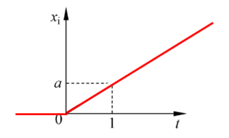

# 时域响应及典型输入信号

* ## 典型输入信号

  1. 阶跃信号

     数学表达式:
     $$
     x_i(t)=
     \begin{cases}
     a &(t>0)\\
     0 &(t<0)
     \end{cases}
     $$
     示意图:  

       

  2. 斜坡信号

     数学表达式:  
     $$
     x_i=
     \begin{cases}
     at &(t>o)\\
     0 &(t<0)
     \end{cases}
     $$
     
     示意图:  
     
       
     
  3. 加速度信号
  
     数学表达式:  
     $$
     x_i=
     \begin{cases}
     at^2 &(t>0)\\
     0 &(t<0)
     \end{cases}
     $$ {  }
     示意图:  
  
       
  
  4. 脉冲信号
  
     数学表达式:  
  
     $$x_i(t)=\begin{cases} \lim_{t_0\to 0}\frac{a}{t_0}&(0<t<t_0)\\ 0&(t<0或t>t_0)	\end{cases}$$  
  
     示意图:  
  
       
  
     ​		当系统输入为单位脉冲函数时,其输出响应称为脉冲响应函数.  
  
     ​		由于$\delta$函数的拉氏变换等于1,因此系统传递函数即为脉冲响应函数的象函数.  
     
     ​		当系统输入任意时间函数时,如图所示,可以将输入信号分割为$n$个脉冲.  
     
     ​		当$n\to \infty$时,输入函数$x(t)$可看成$n$个脉冲叠加而成.  
     
     ​		按比例和时间平移的方法,可得$\tau_k$时刻的响应为$x(\tau_k)g(t-\tau_k)\cdot \Delta\tau$.  
     
     ​		  
     
     所以:  
     $$
     \begin{aligned}
     y(t)&=\lim_{n\to \infty}\sum_{k=0}^nx(\tau_k)g(t-\tau_k)\Delta\tau\\
     &=\int_x^tx(\tau)g(t-\tau)d\tau
     \end{aligned}
     $$ {  }
     ​		输出响应为输入函数与脉冲响应函数的卷积,脉冲响应函数由此又得名权函数.
     
  5. 正弦函数
  
     数学表达式:  
  
     $$x_i(t)=\begin{cases}asin\omega t &(t>0) \\  0 &(t<0)\end{cases}$$   
  
     示意图:  
  
       
  
  
  
  [返回自动控制原理目录](./pac.md)

