

# 时域瞬态响应分析

* ## 一阶系统的瞬态响应

  * ### 一阶系统

    能够用一阶微分方程描述的系统.它的典型形式是一阶惯性关节.  

    $$\frac{X_o(s)}{X_i(s)}=\frac{1}{Ts+1}$$  

    单位脉冲输入$x_i(t)=\delta(t)$  

    象函数为$X_i(s)=1$  

    则$$X_o(s)=\frac{X_o(s)}{X_i(s)}\cdot X_i(s)=\frac{1}{Ts+1}\cdot =\frac{\frac{1}{T}}{S+\frac{1}{T}}$$  

    进行拉氏变换$x_o(t)=(\frac{1}{T}e^{-\frac{1}{T}t})1(t)$  

    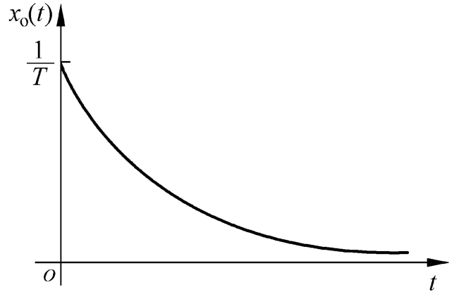  
  
* ## 二阶系统

  用二阶微分方程描述的系统称为二阶系统.  

  它的典型形式是二阶振荡环节

  形势一:$\frac{X_o(s)}{X_i(s)}=\frac{\omega_n^2}{s^2+2\zeta\omega_ns+\omega_n^2}$  

  $\zeta$为阻尼比;$\omega_n$为无阻尼自振角频率  

  形式二:$\frac{X_o(s)}{X_i(s)}=\frac{1}{T^2s^2+2\zeta Ts+1}$  

  $T=\frac{1}{\omega_n}$  

  单位阶跃输入    $x_i(t)=1(t)$  

  象函数为    $X_i(s)=\frac{1}{s}$  

  则$$\begin{aligned} X_o(s)&=\frac{X_o(s)}{X_i(t)}\cdot X_i(s)\\ 	 &=\frac{\omega_n^2}{s^2+2\zeta \omega_ns+\omega_n^2}\cdot \frac{1}{s}\end{aligned}$$  

  根据二阶系统的极点分布特点,分五种情况进行讨论.   

  1. 欠阻尼$0<\zeta<1$

     二阶系统的极点是一对共轭复根  

     $$\frac{X_o(s)}{X_i(s)}=\frac{\omega_n^2}{(s+\zeta \omega_n+j\omega_d)(s+\zeta \omega_n-j\omega_d)}$$  
     
     式中,$\omega_d=\omega_n\sqrt{1-\zeta^2}$,称为阻尼自振角频率  
     
     $$X_o(s)=\frac{1}{s}-\frac{s+\zeta \omega_n}{(s+\zeta \omega_n)^2+]omega_d^2}-\frac{\zeta\omega_n}{(s+\zeta \omega_n)^2+\omega_d^2}$$  
     
     进行拉氏变换,得:  
     
     $$\begin{aligned}x_o(t)&=(1-e^{-\zeta \omega_t}cos(\omega_dt)-\frac{\zeta}{\sqrt{1-\zeta^2}}e^{-\zeta\omega_nt}sin(\omega_dt))1(t)\\	&=(1-\frac{e^{-\zeta\omega_nt}}{\sqrt{1-\zeta^2}}sin(\omega_dt+arctan\frac{\sqrt{1-\zeta^2}}{\zeta}))\cdot 1(t)	\end{aligned}$$  
     
       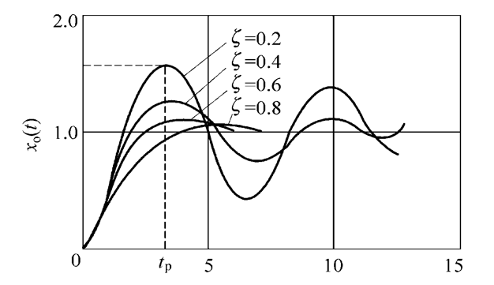  
     
     特点:1.以$\omega_d$为角频率衰减振荡;
     
     ​		 2.随着$\zeta$的减小振荡幅度加大.  
     
  2. 临界阻尼$\zeta=1$
  
     二阶系统的极点是二重负实根  
     $$
     \begin{aligned}
     \frac{X_o(s)}{X_i(s)}&=\frac{\omega_n^2}{(s+\omega_n)^2}\\
     X_o(s)&=\frac{1}{s}-\frac{\omega_n}{(s+\omega_n)^2}-\frac{1}{s+\omega_n}
     \end{aligned}
     $$
     进行拉氏变换,得$x_o(t)=(1-\omega_nte^{-\omega_nt}-e^{-\omega_nt})1(t)$  
     
     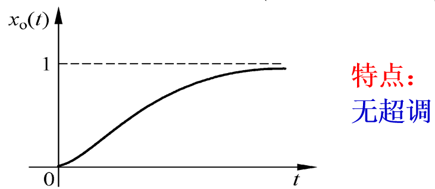  
     
  3. 过阻尼$\zeta>1$
  
     二阶系统的极点是两个负实根
  
     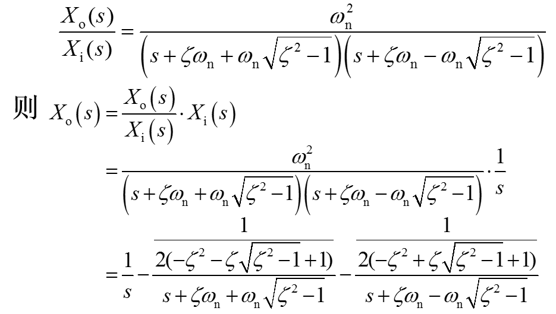  
     
     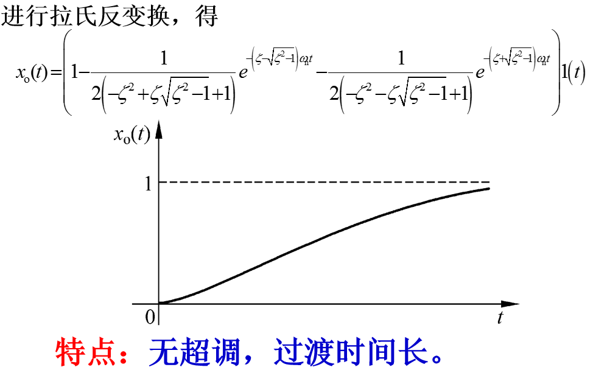  
     
  4. 零阻尼$\zeta=0$
  
     二阶系统的极点是一对共轭虚根  
     $$
     \begin{aligned}
     \frac{X_o(s)}{X_i(s)}&=\frac{\omega_n^2}{s^2+\omega_n^2}\\
     X_o(s)&=\frac{1}{s}-\frac{s}{s^2+\omega^2_n}
     \end{aligned}
     $$
     进行拉氏反变换,得$x_o(t)=(1-cos(\omega_nt))1(t)$  
     
     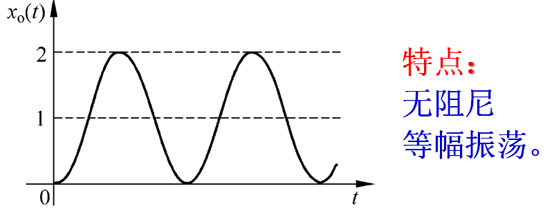  
     
  5. 负阻尼$\zeta<0$
  
     二阶系统的极点具有正实部
  
     响应表达式的指数项变为正指数,随着时间$t\to \infty$,其输出$x_o(t)\to \infty$,系统不稳定.
  
     其响应曲线有两种形式:  
  
      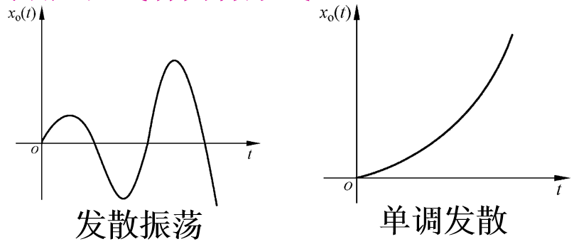单位脉冲输入:      $x_i=\delta(t)$  
  
     象函数为:			$X_i(s)=1$  
  
     则    $X_o(s)=\frac{X_o(s)}{X_i(s)}\cdot X_i(s)=\frac{\omega^2_n}{s^2+2\zeta\omega_ns+\omega_n^2}\cdot 1$  
  
     分三种情况进行讨论:  
  
     1. 欠阻尼$0<\zeta<1$
  
        二阶系统的极点是一对共轭复根  
  
        $$\frac{X_o(s)}{X_i(s)}=\frac{\omega^2_n}{(s+\zeta\omega_n+j\omega_d)(s+\zeta\omega_n-j\omega_d)}$$  
  
        式中,$\omega_d=\omega_n\sqrt{1-\zeta^2}$  
  
        $$X_o(s)=\frac{\omega^2_n}{(s+\zeta\omega_n+j\omega_d)(s+\zeta\omega_n-j\omega_d)}=\frac{\frac{\omega_n}{\sqrt{1-\zeta^2}}\omega_d}{(s+\zeta\omega_n)^2+\omega_d^2}$$  
  
        进行拉氏反变换,得  
  
        $$x_o(t)=(\frac{\omega_n}{\sqrt{1-\zeta^2}}e^{-\zeta\omega_nt}sin(\omega_dt))1(t)$$  
  
        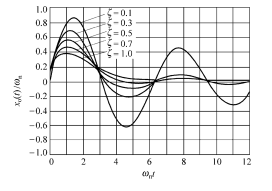  
  
        特点:1.以$\omega_d$为角频率衰减振荡;
  
        ​		 2.随着$\zeta$的减小,振荡幅度加大.
  
     2. 临界阻尼$\zeta=1$
  
        二阶系统的极点是二重负实根  
  
        $$\frac{X_o(s)}{X_i(s)}=\frac{\omega^2_n}{(s+\omega_n)^2}\Longrightarrow X_o(s)=\frac{\omega^2_n}{(s+\omega_n)^2}$$  
  
        进行拉氏反变换,得$x_o(t)=(\omega_n^2te^{-\omega_nt})1(t)$  
  
        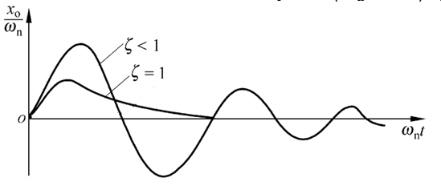  
  
     3. 过阻尼$\zeta>1$
     
        $$x_o(t)=\frac{dx_{o1t}}{dt}=(\frac{\omega_n}{2\sqrt{\zeta^2-1}}(e^{-(\zeta-\sqrt{\zeta^2-1})\omega_nt})-e^{-(\zeta+\sqrt{\zeta^2-1})\omega_nt}))1(t)$$  
     
        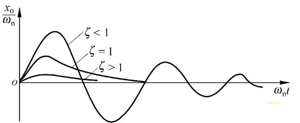  

​                  单位斜坡输入:$x_i(t)=t\cdot 1(t)$  

​				  象函数:			$X_i(s)=\frac1{s^2}$  

​				 则$$X_o(s)=\frac{X_o(s)}{X_i(s)}\cdot X_i(s)=\frac{\omega_n^2}{s^2+2\zeta\omega_ns+\omega_n^2}\cdot \frac1{s^2}$$  

​				分三种情况进行讨论:  

   1. 欠阻尼$0<\zeta<1$  

      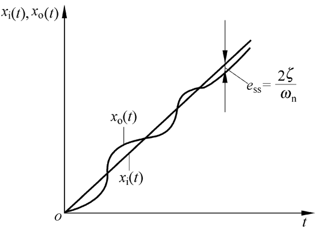  

					2. 临界阻尼$\zeta=1$  

        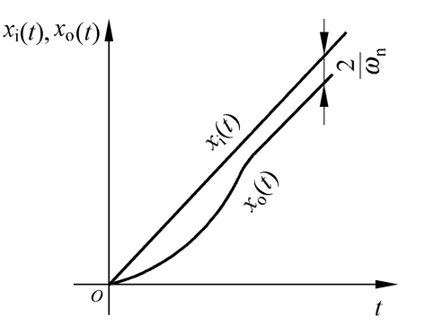  

					3. 过阻尼$\zeta<1$

        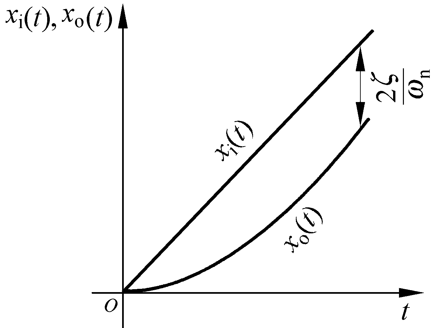  

* ## 时域分析性能指标

  时域分析性能指标是以系统对单位阶跃输入的瞬态响应形式给出的.  

  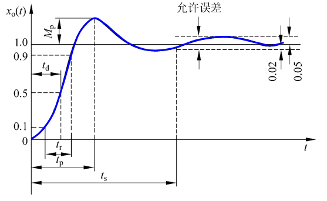  

  1. 上升时间$t_r$

     响应曲线从零时刻首次到达稳态值得时间.或从稳态值得10%上升到稳态值的90%所需的时间.  

     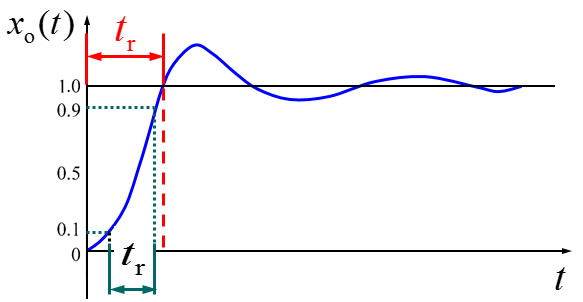  

  2. 峰值时间$t_p$

     响应曲线从零时刻上升到第一个峰值点所需要的时间.  

     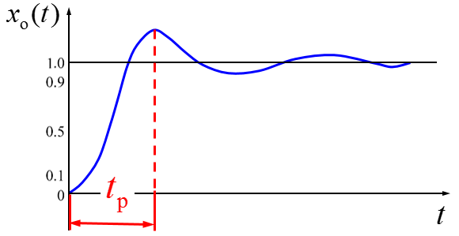  

  3. 最大超调量$M_p$

     响应曲线的最大峰值与稳态值得差与稳态值之比;单位阶跃输入时,即是响应曲线的最大峰值与稳态值的差.通常用百分数表示.  

     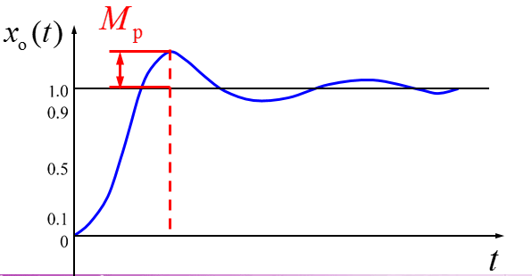  

  4. 调整时间$t_s$

     响应曲线达到并一直保持在允许误差范围内的最短时间.  

     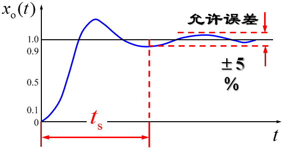  

  5. 延迟时间$t_d$

     响应曲线从零上升到稳态值得50%所需要的时间.  

     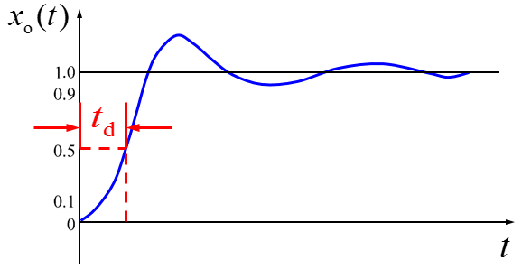  

  6. 振荡次数

     在调整时间$t_s$内响应曲线振荡的次数.  

     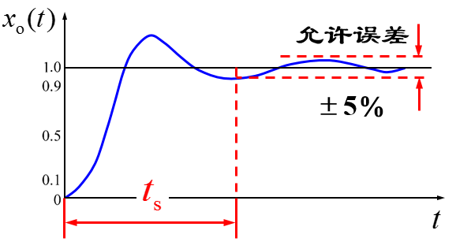  

* 